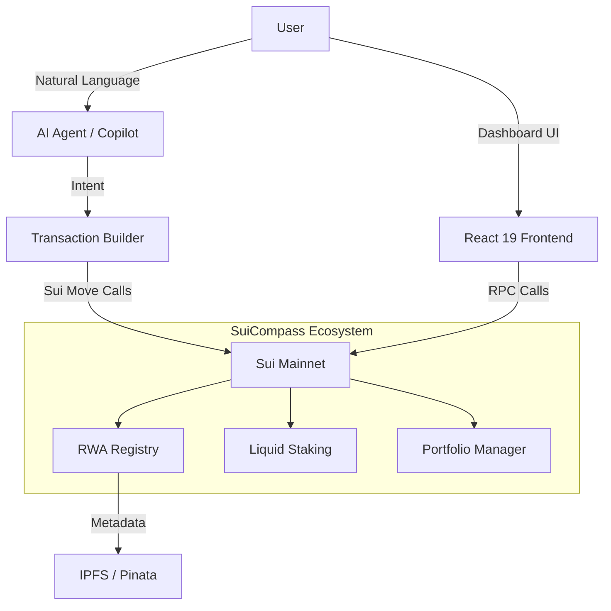

# SuiCompass: AI-Powered DeFi Agent & RWA Protocol

> **The First Intelligent DeFi Agent on Sui Blockchain. Automate RWA Tokenization, Portfolio Management, and Yield Strategies with Natural Language.**

[](https://suiscan.xyz/mainnet)
[](https://suicompass.com)
[](LICENSE)

**🌐 Launch the App**: [suicompass.com](https://suicompass.com)

**SuiCompass** is the first **AI-native DeFi operating system** built on the **Sui Blockchain**. It allows users to interact with complex DeFi protocols using simple natural language commands. From **Real-World Asset (RWA) tokenization** to automated yield farming and portfolio rebalancing, SuiCompass makes institutional-grade DeFi accessible to everyone through a premium "Sui Blue" interface.

---

## 🚀 Why SuiCompass?

### 🤖 **Intelligent AI Agent for DeFi**
Stop wrestling with complex UIs. Just tell SuiCompass what you want to do.
- **"Stake 50 SUI with the highest APY validator"** -> Executed instantly.
- **"Tokenize this invoice for $5,000"** -> Asset minted on-chain.
- **"Rebalance my portfolio to 60% SUI and 40% USDC"** -> Smart routing enabled.
- **Context-Aware**: The AI understands your portfolio history and suggests optimal moves.

### 💎 **RWA Tokenization Engine (Real World Assets)**
Bridging the gap between traditional finance and blockchain.
- **Live on Mainnet**: Tokenize Real Estate, Invoices, and Corporate Bonds today.
- **AI Risk Auditing**: Automated fraud detection and authenticity verification for every asset.
- **Decentralized Storage**: Secure document hosting via IPFS (Pinata).
- **Lifecycle Management**: Track asset status from `Pending` -> `Active` -> `Paid` -> `Settled`.

### 📊 **Institutional-Grade Portfolio Analytics**
- **Real-Time Data**: Live balance tracking and staking positions directly via Sui RPC.
- **Interactive Visualizations**: Dynamic D3.js network graphs mapping your asset relationships.
- **Immersive Experience**: A "Sui Blue" theme with cinematic sound design and particle effects.

### 💧 **Smart Liquid Staking & Yield Optimization**
- **x402 Auto-Agent**: Our autonomous agent monitors APY across validators 24/7.
- **Auto-Compounding**: Automatically restake rewards to maximize compound interest.
- **Risk Management**: Predictive models to avoid slashed validators.

---

## 📜 Advanced Move Smart Contracts Suite

SuiCompass is powered by a comprehensive suite of **11 production-ready Move smart contracts**, designed for speed, security, and scalability.

**[📖 Read the Detailed Contract Overview](CONTRACTS_OVERVIEW.md)**

| Contract | Description | Status |
| :--- | :--- | :--- |
| **1. RWA Registry** | The core engine for tokenizing Real Estate, Invoices, & Bonds. | 🟢 Live |
| **2. Portfolio Manager** | Non-custodial AI-driven portfolio rebalancing. | 🟢 Live |
| **3. Index Fund** | Create or invest in diversified ETF-style baskets with one click. | 🟢 Live |
| **4. Flash Loan** | Zero-capital arbitrage execution engine for advanced traders. | 🟢 Live |
| **5. Prediction Market** | Binary options trading with decentralized Oracle resolution. | 🟢 Live |
| **6. Social Trading** | Copy-trading vaults allowing users to mimic top performers. | 🟢 Live |
| **7. Stream Pay** | Real-time SUI vesting, payroll, and subscription payments. | 🟢 Live |
| **8. Derivatives** | Call Options and advanced financial instruments for RWA NFTs. | 🟢 Live |
| **9. Lossless Lottery** | Gamified savings protocol inspired by PoolTogether. | 🟢 Live |
| **10. Bridge Adaptor** | Unified interface for cross-chain asset transfers. | 🟢 Live |
| **11. Reputation ID** | On-chain credit scoring and identity verification. | 🟢 Live |

## 🔗 Deployed Contracts

| Package | Network | Address |
| :--- | :--- | :--- |
| **RWA Registry** | Mainnet | `0x3fbda5bad770f8a81d1d84741f1bc508a2f30275203c667ef1cc27fb88f750d2` |
| **RWA NFT** | Mainnet | `0x33bd2f7e8b9032625fb2647bc840eeed71e4c2e7fa8a3f2b65d869a2472fc710` |
| **SuiCompass Core** | Mainnet | `0x9cab3a40743b2ee7d6aedb268135fda191d94b14c90a9201d5a713c085b216c4` |

---

## 🛠️ Built with Next-Gen Technology

SuiCompass leverages the latest advancements in web and blockchain technology to deliver a seamless experience.

| Layer | Technology Stack |
|-------|------------------|
| **Blockchain** | **Sui Mainnet** (High throughput, low latency) |
| **Smart Contracts** | **Sui Move** (Object-centric, secure smart contracts) |
| **Frontend** | **React 19**, **TypeScript**, **Vite** |
| **Wallet Connect** | **@mysten/dapp-kit** (Universal wallet support) |
| **Decentralized Storage** | **IPFS** via **Pinata** |
| **AI & NLP** | **EmbedAPI** (Intent Parsing), Custom Risk Models |
| **Design System** | **Tailwind CSS** (Custom "Sui Blue" Theme) |
| **Data Viz** | **D3.js** (Interactive Graphs) |
| **CLI Tools** | **Node.js** (SuiCompass CLI) |

---

## 🏗️ High-Level Architecture



---

## 📦 Quick Start & CLI

SuiCompass includes a powerful CLI for developers and power users.

### Prerequisites
- Node.js 20+
- Sui CLI
- Sui Wallet

### Installation

```bash
# Clone the repository
git clone https://github.com/x5engine/SuiCompass-Protocol.git
cd SuiCompass-Protocol

# Install dependencies
npm install

# Start the development server
npm run dev
```

### CLI Usage
```bash
# Stake SUI via terminal
sui-compass stake --amount 10 --validator 0x...

# Check portfolio balance
sui-compass portfolio --address 0x...
```

---

## 🌟 Roadmap

- [x] **Phase 1: Foundation** - Core Sui integration & Wallet connection.
- [x] **Phase 2: Intelligence** - AI Intent Engine & NLP processing.
- [x] **Phase 3: Automation** - x402 Auto-Agent for yield optimization.
- [x] **Phase 4: Tokenization** - RWA Registry Live on Mainnet.
- [x] **Phase 5: Developer Tools** - CLI Tool & SDK.
- [ ] **Phase 6: Interoperability** - Multi-chain Bridge Support.
- [ ] **Phase 7: Mobile** - Native iOS/Android Applications.

---

## 👨‍💻 Author

**Youssef Khouidi** ([@x5engine](https://github.com/x5engine))

*Building the future of DeFi on Sui.*

---

## 📄 License

This project is licensed under the MIT License - see the [LICENSE](./LICENSE) file for details.
